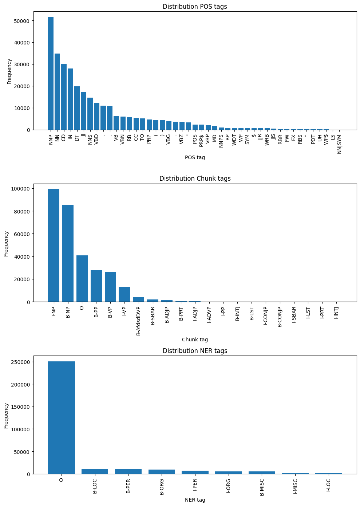
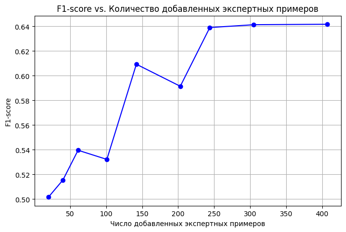

# Named Entity Recognition and Classification (NERC) Using LLM

This project presents a study on Named Entity Recognition and Classification (NERC) using large language models (LLMs). The work is made as a part of test task to ISPRAS. The project divided into three stages—from initial prompt engineering and dataset analysis to model training and a mixed annotation approach. In essence, the project starts by exploring various methods to generate token-level markup on the CoNLL 2003 dataset, then compares the performance of a small neural network trained on LLM-generated annotations versus truth labels, and finally investigates how selectively incorporating expert annotations can further improve model quality. Also it compares cost of expert annotations and LLM-generated annotations.

> This project holds its own repository on a Hugging Face account, where the models and code are stored. The collection can be accessed: [Collection: ner-extraction](https://huggingface.co/collections/estnafinema0/ner-extraction-active-learning-approach-67eff0ec5ce21f81fb7fe5e0).
> [Nerc Extraction Repository](https://huggingface.co/estnafinema0/nerc-extraction).
> [Active Learning Repository](https://huggingface.co/estnafinema0/active-learning-nerc-models-kfold).

## Research Assignment Summary

The original research assignment required solving the NERC task in 4 steps:
1. **Stage 1 – LLM-based Markup Generation:** Develop and experiment with various prompt engineering techniques for extracting and classifying named entities using an LLM. The focus was on designing creative prompts, analyzing the CoNLL 2003 dataset, and generating an initial markup alongside relevant evaluation metrics.
2. **Stage 2 – Training a Neural Model:** Using the best markup generation method from Stage 1, a small neural model (BERT-family) was trained on the LLM-generated annotations. This model (built with a pre-trained BERT backbone and a BiLSTM layer) was then compared with an identical architecture trained on the original truth labels, with comprehensive evaluation metrics provided.
3. **Stage 3 – Mixed Annotation:** To further improve the performance, a mixed dataset was created. A small subset of the examples was annotated by an “expert” (using the truth labels), while the remainder was annotated by the LLM. The study included an analysis of the performance improvement as a function of the expert annotation budget.
4. **Stage 4 - Cheap Testing**

## Running the notebook
The project is implemented in a Jupyter Notebook, which can be run locally or on Google Colab. The notebook contains all the necessary code snippets, visualizations, and evaluation metrics. To run the notebook locally save "secrets" file in the same directory as the notebook. 
```
{
    "API_KEY": "YOUR-API-KEY"
}
```

## Stage 1: Data Analysis and LLM Prompt Engineering

The first stage focused on understanding the CoNLL 2003 dataset and experimenting with various prompts to generate the desired token-level annotations. We started by loading the dataset using the HuggingFace `datasets` library and inspecting its splits—train, validation, and test. An analysis was performed on the distribution of POS, chunk, and NER tags. For example, the code below outlines the key steps:

```python
from datasets import load_dataset
from collections import Counter

dataset = load_dataset("eriktks/conll2003")
print(dataset)

# Analyzing tag distributions
def analyze_tags(dataset):
    pos_counter = Counter()
    chunk_counter = Counter()
    ner_counter = Counter()
    for split in dataset.keys():
        for example in dataset[split]:
            pos_counter.update(example["pos_tags"])
            chunk_counter.update(example["chunk_tags"])
            ner_counter.update(example["ner_tags"])
    return pos_counter, chunk_counter, ner_counter

pos_tags, chunk_tags, ner_tags = analyze_tags(dataset)
```

The results were visualized through bar graphs showing the frequency distributions of the different tag types.  



Additionally, several prompt templates were defined for generating annotations via the LLM. These prompts ranged from simple requests for entity classification to complex instructions that required the LLM to output JSON-formatted token-level tags. For instance, one prompt template was defined as follows:

```python
prompt_7_1 = lambda tokens, pos_tags, chunk_tags, ner_tags: (
    f"Identify each named entity from the following sequence of tokens and "
    f"classify it by the following tags, each token enclosed in backticks: "
    f"Tokens: '{', '.join(f'`{token}`' for token in tokens)}'. "
    f"Return the response in JSON format with fields: tokens, pos_tags, chunk_tags, ner_tags."
)
```

The experiments in Stage 1 laid the foundation for selecting the best-performing method to generate markup for the subsequent model training. 

The requests for the model were sent via API. Models available for the task at that moment (march 2025) were 

```python
'llama3.3:latest',
 'llama3.1:70b',
 'llama3.1:405b',
 'gemma2:27b',
 'mistral-large:123b',
 'command-r-plus:104b',
 'llama3.1:8b',
 'krith/qwen2.5-coder-32b-instruct:IQ3_M',
 'deepseek-coder-v2:236b',
 'llama3.2:latest',
 'mistral:7b',
 'RuadaptQwen2.5-32B-FuseO1-RQS-Preview-GGUF:Q8_0',
 'RuadaptQwen2.5-32B-Pro-Beta-GGUF:Q8_0',
 'RuadaptQwen2.5-32B-QWQ-Beta-GGUF:Q8_0',
 'RuadaptQwen2.5-32B-QWQ-Preview-GGUF:Q8_0',
 'deepseek-r1:14b',
 'deepseek-r1:70b',
 'deepseek-r1:7b',
 'deepseek-r1:8b',
 'qwen2.5-coder:1.5b',
 'qwen2.5-coder:32b-instruct-q8_0'
```

The best statistics were achieved with the model `llama3.1:405b` and the prompt `prompt_7_1`. The results were saved in the dataset and used for the next stages.

## Stage 2: Neural Model Training Using LLM-Generated and Ground Truth Annotations

In the second stage, the focus shifted to training a neural network to perform NERC. The chosen architecture consisted of a pre-trained BERT model for contextual word embeddings, followed by a bidirectional LSTM layer to capture sequential dependencies, and finally a linear classification layer mapping the outputs to NER tags.

A detailed implementation was provided in a Jupyter Notebook. Below is an excerpt from the model initialization and training code:

```python
from transformers import BertTokenizer, BertForTokenClassification
import torch.nn as nn
import torch.optim as optim

# Define custom NER model extending BertForTokenClassification
class NERSmall(BertForTokenClassification):
    def forward(self, input_ids, attention_mask=None, labels=None, label_masks=None):
        outputs = self.bert(input_ids, attention_mask=attention_mask)
        sequence_output = outputs[0]
        # Process token representations using a BiLSTM layer and dropout
        token_reprs = [embedding[mask] for mask, embedding in zip(label_masks, sequence_output)]
        token_reprs = nn.utils.rnn.pad_sequence(token_reprs, batch_first=True, padding_value=-1)
        sequence_output = self.dropout(token_reprs)
        logits = self.classifier(sequence_output)
        # Compute loss if labels are provided
        if labels is not None:
            labels = [label[mask] for mask, label in zip(label_masks, labels)]
            labels = nn.utils.rnn.pad_sequence(labels, batch_first=True, padding_value=-1)
            loss_fct = nn.CrossEntropyLoss(ignore_index=-1, reduction='sum')
            loss = loss_fct(logits.view(-1, self.num_labels), labels.view(-1))
            return (loss, logits)
        return logits

tokenizer = BertTokenizer.from_pretrained("bert-base-cased")
model_primary = NERSmall.from_pretrained("bert-base-cased", num_labels=12).to(device)
optimizer_primary = optim.SGD(model_primary.parameters(), lr=0.001, momentum=0.9)
```

The training loop iterated over several epochs, and both training and evaluation metrics were recorded. For example, the training loss decreased over epochs (e.g., from 0.20 to 0.018), while evaluation on the validation and test sets yielded high accuracy and F1-scores for entities such as PER, ORG, LOC, and MISC. A sample snippet from the evaluation results is shown below:

| Metric             | Primary Model (Truth) |
|--------------------|------------------------------|
| Validation Loss    | 0.0943                       |
| Sequence Accuracy  | 97.96%                       |
| F1-Score           | 88.96%                       |

The model was also saved and pushed to HuggingFace using the following code:

```python
model_primary.push_to_hub("estnafinema0/nerc-extraction", revision="model_primary")
```

In parallel, another model was trained entirely on the LLM-generated annotations (referred to as the "llm_pure" model), which yielded lower performance. A comparative analysis was performed by computing differences in accuracy, F1-score, and loss between the two models. This evaluation informed the next stage of active learning.

## Stage 3: Active learning

### Overview

In this section, we implement an active learning framework for Named Entity Recognition (NER). Our goal is to iteratively improve a base model (already fine-tuned on a low-quality dataset plus an initial 12% of expert examples, i.e. our `model_init_12`) by selecting the most uncertain examples from a large expert dataset and using them to further fine-tune the model. Each intermediate model is saved in a separate branch on Hugging Face, and we record performance metrics (entity-level F1-score, seqeval accuracy, and validation loss) to analyze the improvement as we add more expert examples.

### 1. Entity-Level Evaluation Module

It is a improved metric to evaluate the performance of the model at the entity level, which is crucial for NER. A correct prediction requires that the entire entity (with proper boundaries and correct labels) is recognized correctly.

  1. Prediction Collection: The function processes each batch from the evaluation DataLoader and, for each sentence, collects predicted labels and true labels in a list-of-lists format.
  2. Metric Calculation: It then computes entity-level metrics using the `seqeval` library:
     - Seqeval Accuracy: The overall accuracy calculated on an entity basis.
     - F1-Score: The harmonic mean of precision and recall at the entity level.
     - Classification Report: Detailed precision, recall, and F1 for each entity type.

### 2. Uncertainty Estimation Module

The purpose is to assess the uncertainty of each sentence (example) by computing the average entropy of its tokens. The idea is that a high average entropy indicates the model is less confident in its predictions for that sentence.


We will assess the uncertainty of a sentence using the average entropy of its tokens. For each example (sentence) returned by the `NERDataSet` class, we:

1. Pass it through the model in `eval` mode (with gradients disabled);
2. Retrieve the logits and apply softmax to obtain a probability distribution over labels for each token;
3. For each token (only the “valid” ones, where `ner_tag_mask == 1`), compute the entropy:
   $$
   H(token) = - \sum_{y} P(y\mid token)\log P(y\mid token)
   $$
4. The average entropy across all valid tokens serves as the uncertainty measure for the sentence.

### 3. Preliminary Threshold Experiment with K-Fold Cross-Validation

 Before starting the iterative active learning loop, we run a preliminary experiment to determine the minimal volume of expert examples that yield a significant improvement over the baseline (the model already trained on 12% expert data). Using k-fold cross-validation helps to smooth out random fluctuations and outliers.

  1. For each percentage value (e.g., 1%, 2%, 3%, 5%, 7%, 10%, 12%, 15%, 20%) we determine the number of expert examples to add (using the size of the cheap dataset as a reference).
  2. K-Fold Splitting: The expert dataset is split into *k* folds (we use 5-fold cross-validation).
  3. Fine-Tuning per Fold: For each fold, a subset of expert examples is selected, combined with the cheap dataset, and the model is fine-tuned for a few epochs.
  4. Metric Averaging: We compute and average the evaluation metrics (F1, seqeval accuracy, and validation loss) over all folds.
  5. Graphing: We then build a graph plotting F1-score versus the number of added expert examples to identify the point where improvements saturate.




Below is a comparison of the initial evaluation metrics for two models. The first model, **model_llm_pure**, was trained solely on the low-quality (cheap) dataset, while the second model, **model_init_12**, was fine-tuned on the low-quality dataset combined with an additional 12% of expert examples. As shown in the table, model_init_12 achieves a lower validation loss, higher seqeval accuracy, and a significantly improved F1-Score compared to model_llm_pure.

| Model           | Validation Loss | Seqeval Accuracy | F1-Score |
|-----------------|-----------------|------------------|----------|
| model_llm_pure  | 0.53443         | 0.85185          | 0.47493  |
| model_init_12   | 0.33402         | 0.93084          | 0.65344  |

### 4. Active Learning Loop

  The core iterative loop that implements active learning. Starting from a base model (model_init_12), it repeatedly:
  - Computes uncertainty for remaining expert examples,
  - Selects the top uncertain examples (batch size is controlled by `batch_to_add`, set here to 10),
  - Fine-tunes the model on the combined dataset (initial training data plus newly added expert examples),
  - Saves the intermediate model in a separate branch on Hugging Face,
  - And stops when the improvement (delta F1-score) is below a set threshold (after a minimum number of iterations).


Since model_init_12 is already trained on 12% expert data, the active learning loop should start from an initial training dataset that equals that combined dataset. This ensures that the baseline performance is consistent with model_init_12, and that subsequent improvements are measured relative to that baseline.

To note(!):
```
def active_learning_loop(model, cheap_dataset, expert_dataset, eval_iter,
                         initial_epochs=5, fine_tune_epochs=2, batch_to_add=5,
                         improvement_threshold=0.00005, max_iterations=15,
                         use_initial_training=False, min_iterations = 10)`:  
```   
It now takes an additional parameter `initial_train_dataset`, which is the union of the cheap dataset and the initial 12% expert examples.  
It iterates up to `max_iterations`, and each iteration saves the updated model in a dedicated branch (named based on iteration and total added examples).  
The loop records metrics at each step in a history list.

## Conclusion

This project demonstrates the multifaceted approach to tackling NERC using both LLM-generated and truth annotations. Stage 1 established a robust foundation by experimenting with different prompt designs and analyzing dataset statistics. In Stage 2, a designed neural architecture (leveraging BERT and BiLSTM) was trained on both types of annotations, and comprehensive evaluation revealed the performance gap between the two. Stage 3 further refined the model by incorporating an active learning strategy—mixing a small portion of expert annotations with LLM-generated ones—to achieve improved quality. The detailed implementation, complete with code fragments, evaluation metrics, and graphical analyses, provides a transparent view of each step in this process.
