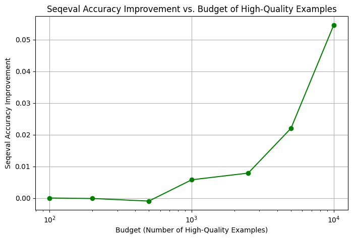
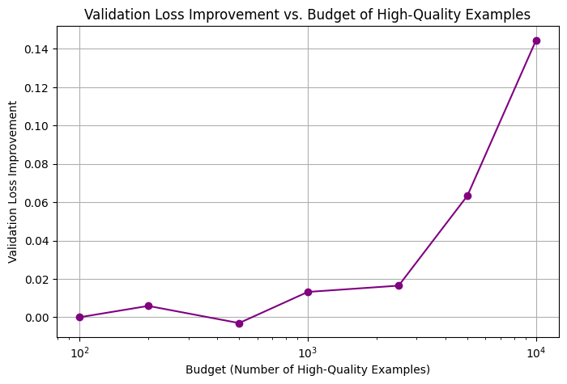

# Named Entity Recognition and Classification (NERC) Using LLM

This project presents a study on Named Entity Recognition and Classification (NERC) using large language models (LLMs). The work is made as a part of test task to ISPRAS. The project divided into three stages—from initial prompt engineering and dataset analysis to model training and a mixed annotation approach. In essence, the project starts by exploring various methods to generate token-level markup on the CoNLL 2003 dataset, then compares the performance of a small neural network trained on LLM-generated annotations versus truth labels, and finally investigates how selectively incorporating expert annotations can further improve model quality. Also it compares cost of expert annotations and LLM-generated annotations.

> This project holds its own repository on a Hugging Face account, where the models and code are stored. The repository can be accessed [here](https://huggingface.co/estnafinema0/nerc-extraction).

## Research Assignment Summary

The original research assignment required solving the NERC task in 4 steps:
1. **Stage 1 – LLM-based Markup Generation:** Develop and experiment with various prompt engineering techniques for extracting and classifying named entities using an LLM. The focus was on designing creative prompts, analyzing the CoNLL 2003 dataset, and generating an initial markup alongside relevant evaluation metrics.
2. **Stage 2 – Training a Neural Model:** Using the best markup generation method from Stage 1, a small neural model (BERT-family) was trained on the LLM-generated annotations. This model (built with a pre-trained BERT backbone and a BiLSTM layer) was then compared with an identical architecture trained on the original truth labels, with comprehensive evaluation metrics provided.
3. **Stage 3 – Mixed Annotation:** To further improve the performance, a mixed dataset was created. A small subset of the examples was annotated by an “expert” (using the truth labels), while the remainder was annotated by the LLM. The study included an analysis of the performance improvement as a function of the expert annotation budget.
4. **Stage 4 - Cheap Testing**

## Running the notebook
The project is implemented in a Jupyter Notebook, which can be run locally or on Google Colab. The notebook contains all the necessary code snippets, visualizations, and evaluation metrics. To run the notebook locally save "secrets" file in the same directory as the notebook. 
```
{
    "API_KEY": "YOUR-API-KEY"
}
```

## Stage 1: Data Analysis and LLM Prompt Engineering

The first stage focused on understanding the CoNLL 2003 dataset and experimenting with various prompts to generate the desired token-level annotations. We started by loading the dataset using the HuggingFace `datasets` library and inspecting its splits—train, validation, and test. An analysis was performed on the distribution of POS, chunk, and NER tags. For example, the code below outlines the key steps:

```python
from datasets import load_dataset
from collections import Counter

dataset = load_dataset("eriktks/conll2003")
print(dataset)

# Analyzing tag distributions
def analyze_tags(dataset):
    pos_counter = Counter()
    chunk_counter = Counter()
    ner_counter = Counter()
    for split in dataset.keys():
        for example in dataset[split]:
            pos_counter.update(example["pos_tags"])
            chunk_counter.update(example["chunk_tags"])
            ner_counter.update(example["ner_tags"])
    return pos_counter, chunk_counter, ner_counter

pos_tags, chunk_tags, ner_tags = analyze_tags(dataset)
```

The results were visualized through bar graphs showing the frequency distributions of the different tag types.  


Additionally, several prompt templates were defined for generating annotations via the LLM. These prompts ranged from simple requests for entity classification to complex instructions that required the LLM to output JSON-formatted token-level tags. For instance, one prompt template was defined as follows:

```python
prompt_7_1 = lambda tokens, pos_tags, chunk_tags, ner_tags: (
    f"Identify each named entity from the following sequence of tokens and "
    f"classify it by the following tags, each token enclosed in backticks: "
    f"Tokens: '{', '.join(f'`{token}`' for token in tokens)}'. "
    f"Return the response in JSON format with fields: tokens, pos_tags, chunk_tags, ner_tags."
)
```

The experiments in Stage 1 laid the foundation for selecting the best-performing method to generate markup for the subsequent model training. 

The requests for the model were sent via API. Models available for the task at that moment (march 2025) were 

```python
'llama3.3:latest',
 'llama3.1:70b',
 'llama3.1:405b',
 'gemma2:27b',
 'mistral-large:123b',
 'command-r-plus:104b',
 'llama3.1:8b',
 'krith/qwen2.5-coder-32b-instruct:IQ3_M',
 'deepseek-coder-v2:236b',
 'llama3.2:latest',
 'mistral:7b',
 'RuadaptQwen2.5-32B-FuseO1-RQS-Preview-GGUF:Q8_0',
 'RuadaptQwen2.5-32B-Pro-Beta-GGUF:Q8_0',
 'RuadaptQwen2.5-32B-QWQ-Beta-GGUF:Q8_0',
 'RuadaptQwen2.5-32B-QWQ-Preview-GGUF:Q8_0',
 'deepseek-r1:14b',
 'deepseek-r1:70b',
 'deepseek-r1:7b',
 'deepseek-r1:8b',
 'qwen2.5-coder:1.5b',
 'qwen2.5-coder:32b-instruct-q8_0'
```

The best statistics were achieved with the model `llama3.1:405b` and the prompt `prompt_7_1`. The results were saved in the dataset and used for the next stages.

## Stage 2: Neural Model Training Using LLM-Generated and Ground Truth Annotations

In the second stage, the focus shifted to training a neural network to perform NERC. The chosen architecture consisted of a pre-trained BERT model for contextual word embeddings, followed by a bidirectional LSTM layer to capture sequential dependencies, and finally a linear classification layer mapping the outputs to NER tags.

A detailed implementation was provided in a Jupyter Notebook. Below is an excerpt from the model initialization and training code:

```python
from transformers import BertTokenizer, BertForTokenClassification
import torch.nn as nn
import torch.optim as optim

# Define custom NER model extending BertForTokenClassification
class NERSmall(BertForTokenClassification):
    def forward(self, input_ids, attention_mask=None, labels=None, label_masks=None):
        outputs = self.bert(input_ids, attention_mask=attention_mask)
        sequence_output = outputs[0]
        # Process token representations using a BiLSTM layer and dropout
        token_reprs = [embedding[mask] for mask, embedding in zip(label_masks, sequence_output)]
        token_reprs = nn.utils.rnn.pad_sequence(token_reprs, batch_first=True, padding_value=-1)
        sequence_output = self.dropout(token_reprs)
        logits = self.classifier(sequence_output)
        # Compute loss if labels are provided
        if labels is not None:
            labels = [label[mask] for mask, label in zip(label_masks, labels)]
            labels = nn.utils.rnn.pad_sequence(labels, batch_first=True, padding_value=-1)
            loss_fct = nn.CrossEntropyLoss(ignore_index=-1, reduction='sum')
            loss = loss_fct(logits.view(-1, self.num_labels), labels.view(-1))
            return (loss, logits)
        return logits

tokenizer = BertTokenizer.from_pretrained("bert-base-cased")
model_primary = NERSmall.from_pretrained("bert-base-cased", num_labels=12).to(device)
optimizer_primary = optim.SGD(model_primary.parameters(), lr=0.001, momentum=0.9)
```

The training loop iterated over several epochs, and both training and evaluation metrics were recorded. For example, the training loss decreased over epochs (e.g., from 0.20 to 0.018), while evaluation on the validation and test sets yielded high accuracy and F1-scores for entities such as PER, ORG, LOC, and MISC. A sample snippet from the evaluation results is shown below:

| Metric             | Primary Model (Truth) |
|--------------------|------------------------------|
| Validation Loss    | 0.0943                       |
| Sequence Accuracy  | 97.96%                       |
| F1-Score           | 88.96%                       |

The model was also saved and pushed to HuggingFace using the following code:

```python
model_primary.push_to_hub("estnafinema0/nerc-extraction", revision="model_primary")
```

In parallel, another model was trained entirely on the LLM-generated annotations (referred to as the "llm_pure" model), which yielded lower performance. A comparative analysis was performed by computing differences in accuracy, F1-score, and loss between the two models. This evaluation informed the next stage of active learning.

## Stage 3: Mixed Annotations

To bridge the performance gap, Stage 3 introduced an mixed annotations approach. In this stage, a mixed dataset was created by combining the cheap LLM-generated annotations with a small percentage of expert (truth) labels. The mixing function was defined as follows:

```python
def mix_datasets(expert, cheap, percentage):
    base_size = len(cheap)
    additional = Subset(expert, torch.arange(int(base_size * percentage)))
    dataset = ConcatDataset([cheap, additional])
    return DataLoader(dataset=dataset, batch_size=BATCH_SIZE, shuffle=True)
```

Experiments were conducted with varying percentages (1%, 2%, 5%, 10%, 25%, 50%, 100%) of expert annotations. For each mix, the model was retrained, and its evaluation metrics were recorded. The performance improvements were visualized by plotting the increase in seq eval-score against the proportion of expert annotations.  

 


We see that the validation loss is highest when only a minimal fraction of high-quality data is used. As the proportion of high-quality data increases, the validation loss steadily decreases

A representative output from the comparison function highlighted that the primary model (trained on truth) outperformed the llm_pure model by a significant margin (e.g., a 14% increase in accuracy and a 42.9% increase in F1-score). These results underscore the impact of annotation quality on model performance.


## Conclusion

This project demonstrates the multifaceted approach to tackling NERC using both LLM-generated and truth annotations. Stage 1 established a robust foundation by experimenting with different prompt designs and analyzing dataset statistics. In Stage 2, a designed neural architecture (leveraging BERT and BiLSTM) was trained on both types of annotations, and comprehensive evaluation revealed the performance gap between the two. Stage 3 further refined the model by incorporating an active learning strategy—mixing a small portion of expert annotations with LLM-generated ones—to achieve improved quality. The detailed implementation, complete with code fragments, evaluation metrics, and graphical analyses, provides a transparent view of each step in this process.